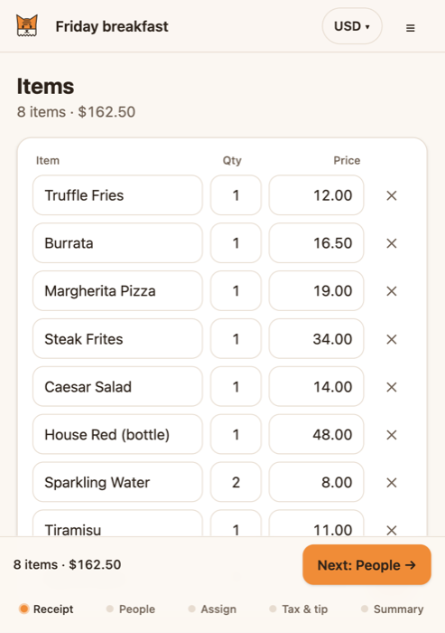
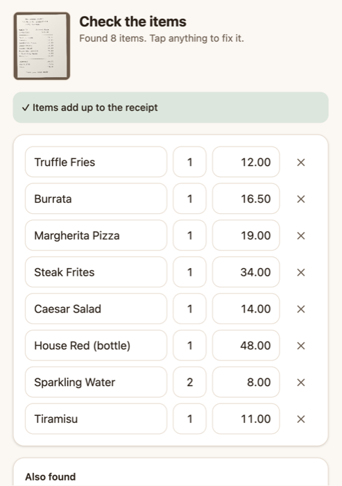
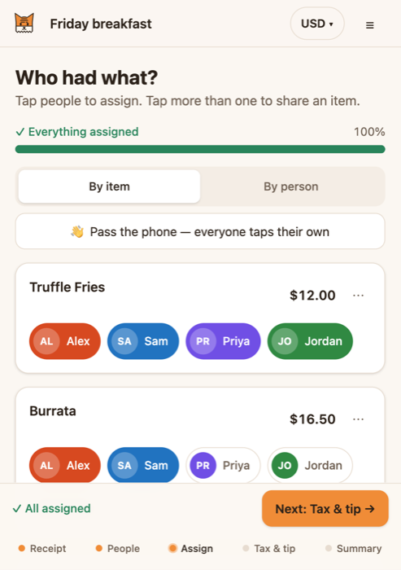
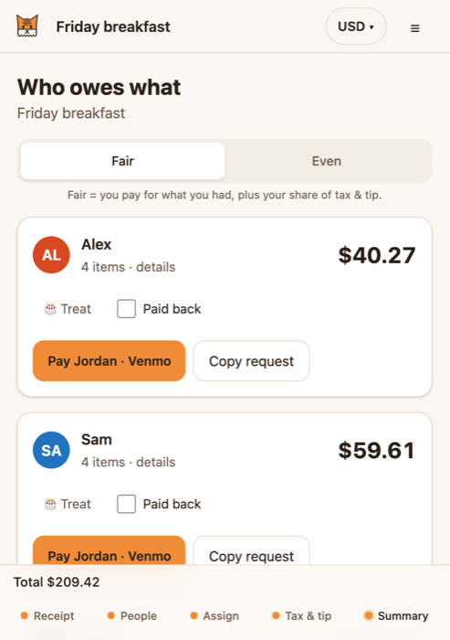
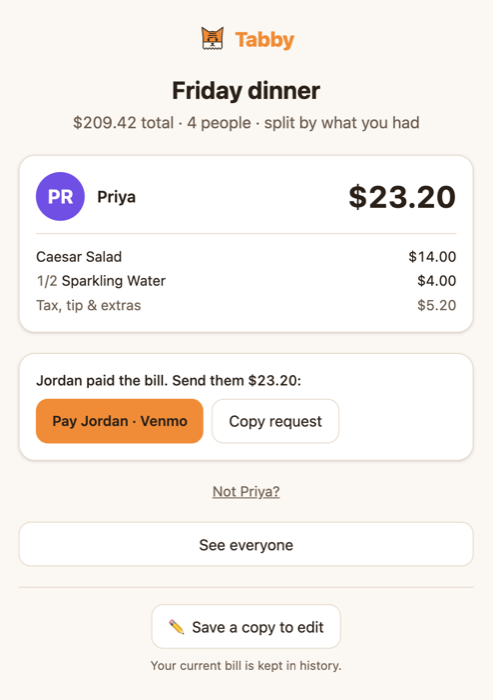
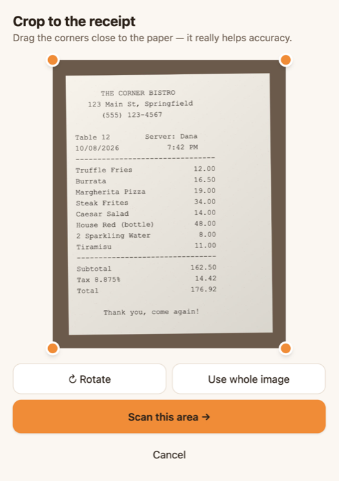

<p align="center"></p>

<h1 align="center">Tabby</h1>
<p align="center"><b>Split the tab.</b> Snap the receipt, tap who had what, and everyone knows what they owe.</p>
<p align="center"><a href="https://loupgarou451.github.io/Tabby/">Live app</a> · <a href="TABBY_DESIGN.md">Design spec</a></p>

---

## Getting started

```bash
git clone https://github.com/LoupGarou451/Tabby.git
cd Tabby
npm install && npm run dev
```

That's it: no API keys, no `.env`, no accounts, no extra downloads. Requires Node.js 20 or newer.

- Open the **Local** URL Vite prints (usually http://localhost:5173).
- To try it on your phone (including the camera), open the **Network** URL it prints while on the same Wi-Fi.
- In a hurry? Tap **Try a sample receipt**, or **or try scanning a sample photo** to watch the on-device OCR work.

## Screenshots

| Enter or scan items | Scan → review | Tap who had what |
|---|---|---|
|  |  |  |

| Who owes what | A friend opens the share link | Crop before scanning |
|---|---|---|
|  |  |  |

## Features

**The basics, done carefully**
- Enter items by keyboard (Enter jumps to the next field), or **scan a receipt**: take a photo on your phone or upload one on any device (drag-and-drop and paste work too).
- Add people, then tap chips to assign items. Tap several people to share an item, or use **custom shares** (2 parts : 1 part) when someone only had a bite.
- Tax and tip as an amount or %, with 18/20/22% presets that show the dollar amount, tip before or after tax.
- A summary card for each person, with an item-by-item breakdown.

**Product decisions** (all in [section 8 of the spec](TABBY_DESIGN.md#8-calculation-rules-the-product-decisions))
- **Fair by default.** Tax and tip are split in proportion to what each person ordered, so the friend who "only had a salad" doesn't subsidize the steak. Flip to **Even** to see each person's difference.
- **Never off by a cent.** All money is stored as whole cents. Every split uses the largest-remainder method, so the totals always add up exactly ("✓ Adds up to $209.42 exactly").
- Unassigned items are never silently spread across everyone; they're shown, with one-tap fixes.

**For the table**
- **Share link + QR code**: friends tap their name and see their total with a **Pay via Venmo / Cash App** button. There's no backend: the whole bill is compressed into the link, which works from the public site or over local Wi-Fi.
- **Pass the phone**: "Hand to Alex" → Alex taps what they had → next person.
- **Quick split**: just the total, the number of people and the tip. Done in three taps.
- **🎂 Treat** someone (birthday!), **round everyone up** (the extra goes to the tip), mark who has **paid back**.
- **Currency picker** for any currency the browser knows, including no-decimal (¥) and three-decimal (BHD) currencies.
- Bill history, undo, dark mode, first-run tips, keyboard- and screen-reader-friendly controls, and a splash with a tabby-cat logo whose stripes are receipt lines.

**Receipt scanning, entirely on your device**
- Tesseract.js runs in a Web Worker. Its files are served by the app itself, so nothing is uploaded and it works offline.
- A crop step, then a tested parser that handles quantities, modifiers ("+ avocado"), discounts, service charges, OCR typos like `T0TAL`, and European or no-decimal formats.
- A review screen highlights low-confidence lines and checks the items against the printed subtotal and total, offering "Add $11.00 as unlisted item" when something was missed.

## Scripts

| Command | What it does |
|---|---|
| `npm run dev` | Start the dev server (also reachable on your local network) |
| `npm run build` | Type-check and build to `dist/` |
| `npm run preview` | Serve the production build |
| `npm test` | Unit tests: money math, split rules, receipt parser, share links (58 tests) |
| `npm run lint` | Lint with oxlint |

## How it's built

Vite + React 19 + TypeScript, Tailwind CSS v4, Zustand (saved to localStorage), Zod, Tesseract.js, lz-string and qrcode. Everything is free and open source, with no paid services.

All the arithmetic lives in one pure, tested function, `computeSplit()` in [`src/lib/split.ts`](src/lib/split.ts); the UI never does money math. The full spec, including a log of decisions made during the build, is in [TABBY_DESIGN.md](TABBY_DESIGN.md).

Every push to `main` runs the tests and deploys to GitHub Pages.

## How AI was used

Built end to end with **Claude Code**; no code was written by hand.

1. **Spec first.** Claude drafted a design doc from the brief. I reviewed it over several rounds: I removed paid AI services, required zero setup, and chose the logo, license and features. It ended up as a self-contained spec a fresh session could build from.
2. **Milestones.** Claude built M0–M7 in order, running build, tests and lint before each commit.
3. **Real-browser testing.** Claude drove Chrome to test each milestone and fixed what it found. That included two non-obvious OCR issues: a version mismatch between `tesseract.js` and its WASM core, and image "enhancement" that made OCR *worse* (reading went from ~14 s with junk characters to ~3 s and accurate). Both are recorded in the spec's decision log.

The app itself uses no AI at runtime.

## What I'd do with another hour

- **Automatic receipt edge detection** (perspective correction) instead of a manual crop. It's the biggest remaining accuracy win for real-world photos.
- **PWA install + offline caching**, so it opens instantly at a restaurant with bad signal.
- **"Who's drinking?"**: assign all the drinks to the drinkers in one tap.
- **Tap a scanned item to highlight its line** on the receipt photo (Tesseract already returns the positions).

## License

[MIT](LICENSE) © 2026 Jeff Fulton
